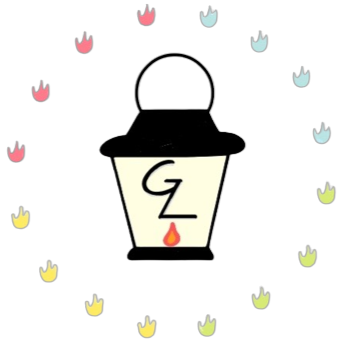
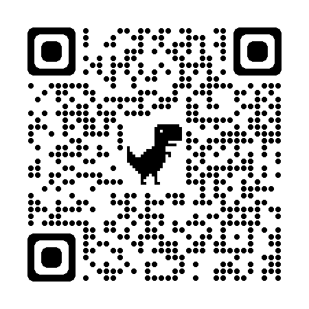
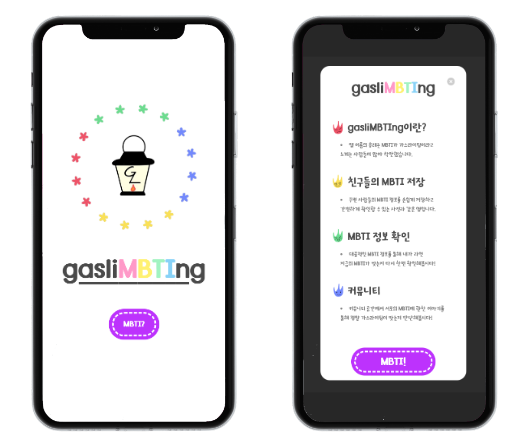
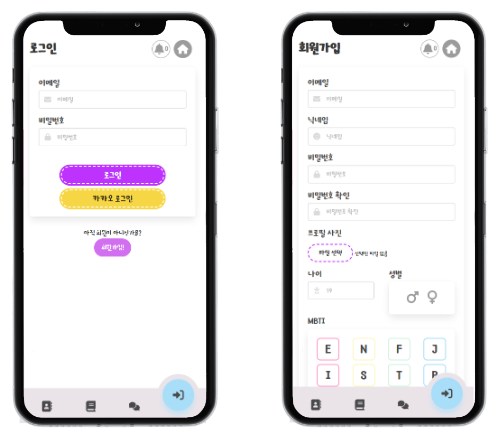
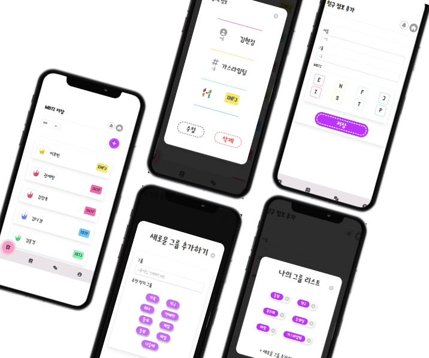
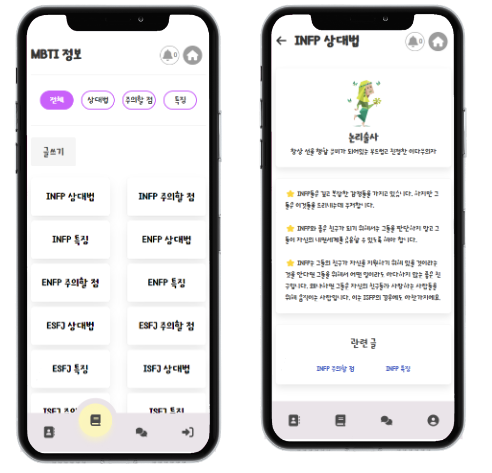
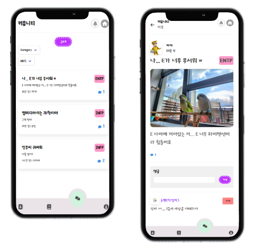
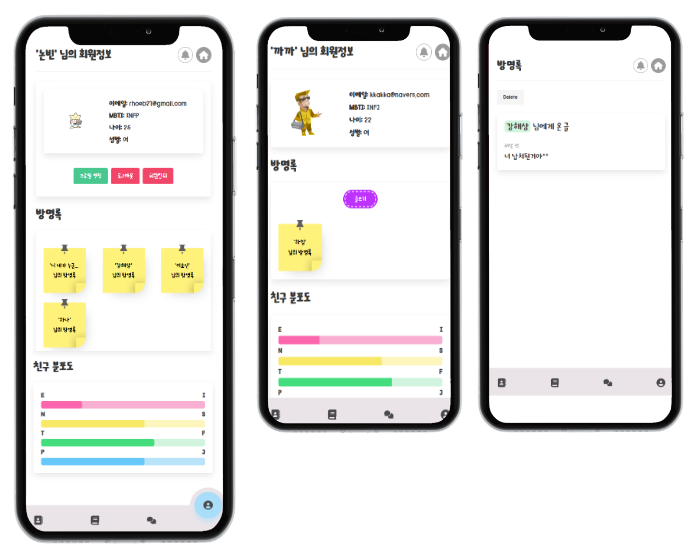

# 🔥gasliMBTIng

> 'MBTI는 gaslighting인가?'라는 의문에 이름을 gaslighting과 MBTI를 합쳐 gasliMBTIng으로 정함
>
> gasliMBTIng의 초성을 따 GL을 가운데 로고로 넣고, 16개의 MBTI를 작은 불씨로 표현하여 가스등 주변에 배치

 

## ✅기획 의도

- MBTI가 핫해짐에 따라 많은 사람들이 처음 만난 자리에서 MBTI의 종류를 묻고 그 사람의 성향을 판단하는 것에서 시작
- 많은 사람들의 MBTI를 기억하기 어려워 자신만의 주변 사람들 MBTI 정보를 저장할 수 있는 사전과 같은 형태의 앱이 필요하다고 판단

 

## ✅프로젝트 바로가기

- QR 코드를 통해 프로젝트 링크 접속 가능

 

### ⭐ 프로젝트 링크 : https://www.gaslimbting.xyz/

 

## ✅팀 구성

- **프론트엔드** : 이우열(팀장)
- **백엔드** : 김현정, 노은빈, 이상욱, 최준우

 

## ✅프로젝트 기여도

- 프론트엔드 개발 담당 및 팀장의 역할로 모든 프로젝트의 기획 및 디자인을 담당
- 프론트엔드 개발 당시 모든 팀원들이 `Vue.js`의 기술을 처음 도입하는 시기였기 때문에 먼저 `Vue.js`를 접해보고 팀원들에게 `Vue.js`를 활용할 수 있도록 설명하고 적용할 수 있도록 길잡이 역할을 수행

 

## ✅프로젝트 기간

- 2022.11.24 ~ 2022.12.15

 

## ✅기술 스택

    
 
   

 

### 프론트엔드

- `Vue.js`를 활용하여 프론트엔드 단 페이지 개발

### 백엔드

- `Django REST Framework`를 통해 REST API를 생성해 프론트엔드와 통신

 

## ✅프로젝트 페이지 설명

### 📄메인 페이지

- 로고의 16개 별은 MBTI의 16가지 성격 유형을 표현했습니다.
- 별 중앙에 있는 가스등은 gaslighting의 유래인, 1944년 영화 <가스등>에서 착안하여 심볼 마크로 지정하였습니다.
- `[MBTI?]`버튼을 누르면 Modal 팝업창이 출력됩니다.
- Modal 팝업창에서는 gasliMBTIng에 대한 설명과 앱 사용에 대해 간단히 설명하고 있습니다.

 

### 📄로그인, 회원가입 페이지

- 이메일, 비밀번호로 로그인합니다. 또한 카카오 로그인을 통해 소셜 로그인이 가능합니다.
- 계정이 없다면 `[회원 가입]`을 통해 회원가입이 가능합니다.
- 회원가입은 이메일, 닉네임, 비밀번호, 프로필 사진, 나이, 성별, MBTI 정보를 입력받습니다.
- 계정 인증은 DRF(Django REST work)의 Token 인증을 기반으로 하고 있습니다.
- 회원가입이 이루어지면 사용자에 대해 Token을 발급합니다.
- 이 Token을 발급받은 사용자가 이메일, 비밀번호를 입력하여 로그인하게 되면 서버에게 발급받은 Toekn을 전달함으로써 정당한 사용자임을 인정받습니다.

 

### 📄MBTI 저장 페이지

- 친구, 가족 등 지인들의 MBTI 정보를 저장할 수 있는 페이지 입니다. 이름, MBTI, 그룹태그를 넣어 저장하고 목록을 생성할 수 있습니다.
- 그룹태크는 기본적으로 주어진 `[추천 인기 그룹 태그]`중 선택하거나, 직접 새로운 그룹태그를 입력하여 생성하고 분류할 수 있습니다.
- 상단의 그룹 태그별 필터 기능을 통해 해당 그룹의 지인들만 조회할 수도 있습니다. 이를 통해 지인들의 MBTI 정보를 관리할 수 있습니다.

 

### 📄MBTI 정보 페이지

- MBTI 정보에서는 MBTI 성격 유형 별 다양한 글을 열람할 수 있도록 한 조회 페이지 입니다.
- MBTI 별 성격 특징을 알려주기도 하며, 다른 MBTI의 사람을 만날 때 주의할 점이나 상대하는 유용한 방법을 안내합니다.
- 정보 게시글을 읽고 나면 하단에 관련 글 링크를 제공하여 열람한 페이지의 MBTI 관련 다른 글에 쉽게 접근할 수 있도록 합니다.
- 게시글을 편리하게 열람할 수 있도록 상단에 분류 버튼을 제공하여 유형별 게시글을 필터하여 필요한 정보만을 볼 수 있도록 합니다.

 

### 📄커뮤니티 페이지

- 커뮤니티는 사용자 간에 자유롭게 글을 쓰고 의견을 주고 받는 페이지입니다.
- 커뮤니티 글을 작성할 때 글의 유형이 무엇인지 카테고리를 선택하고 본인의 MBTI 정보를 입력하여, 글을 읽는 사람들이 이 글이 어떤 MBTI 사람의 글인지를 쉽게 파악하게 합니다.
- 이미지를 업로드할 수 있어 글을 더욱 재밌게 열람할 수 있고, 글 작성 시점으로부터 시간이 얼마나 경과하였는지 알려줍니다.
- 글을 읽은 사람이 이에 대한 공감으로 댓글을 작성하고 필요할 경우 삭제할 수 있도록 하였습니다.
- 이 때 접속한 사용자가 댓글 쓴 작성자일 경우 `(작성자)`로 표시하여 본인이 작성한 댓글임을 쉽게 알아볼 수 있도록 하였습니다.

 

### 📄회원정보, 방명록 페이지

- 회원정보 페이지에서는 사용자 본인의 정보를 확인하고 편집할 수 있습니다. 또한 로그아웃, 회원탈퇴 버튼을 통해 계정 사용을 중지하거나 계정 삭제를 할 수 있습니다.
- 다른 사용자의 회원정보 페이지에 접근하여 방명록을 쓸 수 있도록 하였습니다.
- 방명록 작성자명은 접속한 계정이 아닌, 사용자가 직접 설정하여 익명으로 작성할 수 있습니다. 또한 본인의 회원정보 페이지에서 다른 사용자가 남긴 방명록을 열람할 수 있습니다.
- MBTI 저장 페이지에서 저장한 친구의 MBTI를 분석하여, 내가 등록한 사람들의 MBTI 분포도를 쉽게 열람할 수 있도록 가로 막대 그래프로 가시화 하였습니다.
